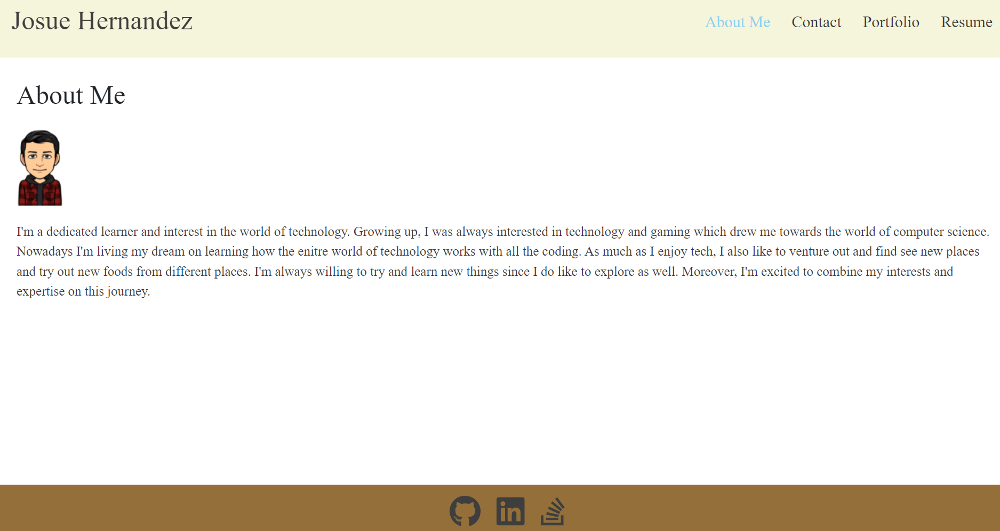

# JosueCodeCrafted

## Description

My motivaton to building my portfolio was to see how far I got from the start of the bootcamp and to alos let employers see the apps I build
in the projects tabs. During the development, I encountered some difficulties with styling the images, but I solved my issue by reading the Bootstrap
documents and other online resources. Reading the bootstrap allowed my to learn some new things I didn't know before, making me have a better understanding
about bootstrap.

## Usage

## Credits

Raymond Bautista: https://github.com/Raymond2811

https://www.nobledesktop.com/learn/web-design/bootstrap-creating-a-photo-grid

https://getbootstrap.com/

## License

Used the MIT License.